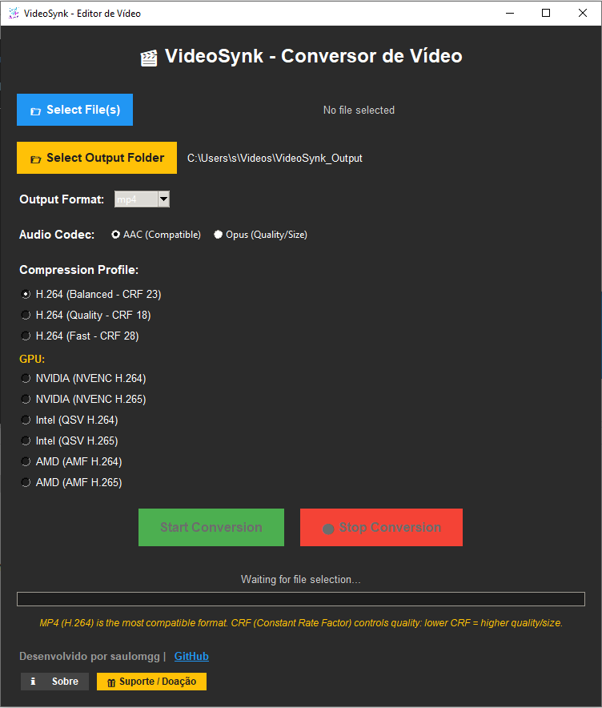

# 🎬 ConvertSynk - Conversor de Vídeo Profissional

O **ConvertSynk** é uma ferramenta de alta performance para conversão e compressão de vídeo, desenvolvida como parte integrante do ecossistema **HubSynk**. Projetado para ser simples, mas extremamente poderoso, ele utiliza o motor do **FFmpeg** para entregar resultados profissionais com uma interface intuitiva.

---

## 🚀 Funcionalidades Principais

- **Conversão Multi-Formato:** Suporte total para MP4, MKV, WebM e MOV.
- **Compressão Inteligente:** Perfis pré-configurados (Balanced, Quality, Fast) para H.264, H.265 (HEVC) e VP9.
- **Aceleração por Hardware (GPU):** Detecção automática e suporte para NVIDIA (NVENC), Intel (QSV) e AMD (AMF).
- **Áudio de Alta Fidelidade:** Escolha entre codecs AAC (máxima compatibilidade) ou Opus (melhor eficiência).
- **Processamento em Lote:** Converta múltiplos vídeos sequencialmente com um único clique.
- **Interface Moderna:** Tema escuro otimizado para produtividade, desenvolvido em Tkinter.

---

## 🛠️ Estrutura do Projeto

O projeto segue uma arquitetura modular para facilitar a manutenção e escalabilidade:

| Módulo | Descrição |
| :--- | :--- |
| `main.py` | Ponto de entrada da aplicação. |
| `core/` | Lógica de processamento e integração com FFmpeg. |
| `ui/` | Interface Gráfica do Usuário (GUI). |
| `utils/` | Funções auxiliares, constantes e detecção de hardware. |
| `assets/` | Recursos visuais, ícones e identidate visual. |

---

## 💻 Como Executar

### Pré-requisitos

1. **Python 3.10+**
2. **FFmpeg instalado e no PATH do sistema.**

### Instalação

1. Clone o repositório:
   
   git clone https://github.com/saulomgg/convertsynk.git
   cd convertsynk
  

2. Instale as dependências (opcional, para desenvolvimento):
  
   pip install -r requirements.txt
  

3. Execute:
   
   python main.py
  

---

## 🤝 Contribuição e Suporte

O ConvertSynk é um projeto de código aberto. Sinta-se à vontade para abrir **Issues** ou enviar **Pull Requests**.

- **Desenvolvido por:** [saulomgg](https://github.com/saulomgg)
- **Ecossistema:** [HubSynk](https://github.com/saulomgg/HubSynk)
- **Wiki:** [Acesse nossa Wiki para documentação detalhada](https://github.com/saulomgg/VideoSynk/wiki)

---

## 📄 Licença

Este projeto está sob a licença MIT. Veja o arquivo [LICENSE](LICENSE) para mais detalhes.

---
*Desenvolvido por saulomgg.
